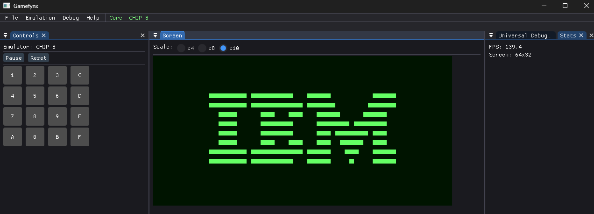
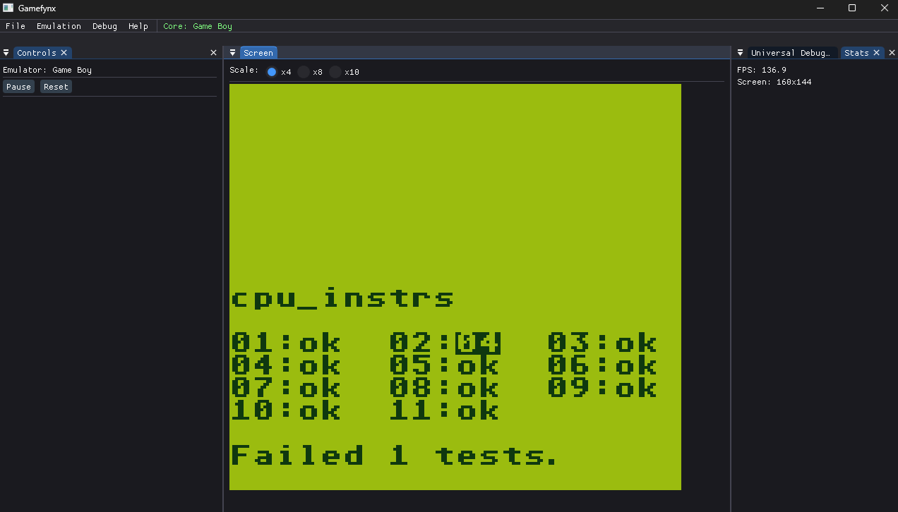

# Gamefynx

A multi-emulator project built in C++ with imGui and SDL3.

### Supported Systems

| System | Status      | Notes |
|--------|-------------|-------|
| CHIP-8 | Almost Done | Simple 8-bit system |
| Game Boy | In Progress | DMG (original Game Boy) |

## Roadmap
### Setup
- [x] Project structure
- [x] SDL3 + ImGui setup

### CHIP-8
- [X] Core implementation
- [X] Display rendering
- [X] Input handling
- [ ] Sound
- [X] Debugger UI

### Gameboy
- [X] CPU
- [X] MMU
- [X] PPU
- [ ] Input handling
- [ ] Sound
- [ ] Shader implementation

### Future Systems
- Update vers Gameboy Color
- NES
- Atari ST

## Librairy

- [Dear ImGui](https://github.com/ocornut/imgui) - Immediate mode GUI library
- [SDL3](https://www.libsdl.org/) - Cross-platform multimedia library
- [FMT](https://fmt.dev/) - A modern formatting library
- [PDF](https://github.com/samhocevar/portable-file-dialogs/) Portable File Dialogs

## Resources

### CHIP-8
- [Cowgod's CHIP-8 Technical Reference](http://devernay.free.fr/hacks/chip8/C8TECH10.HTM)
- [Tobias V's CHIP-8 Guide](https://tobiasvl.github.io/blog/write-a-chip-8-emulator/)
- [CHIP-8 Test Suite](https://github.com/Timendus/chip8-test-suite)

### Game Boy
- [Pan Docs](https://gbdev.io/pandocs/) - Complete GB technical documentation
- [gbdev.io](https://gbdev.io/) - GB development resources
- [The Ultimate Game Boy Talk](https://www.youtube.com/watch?v=HyzD8pNlpwI)

